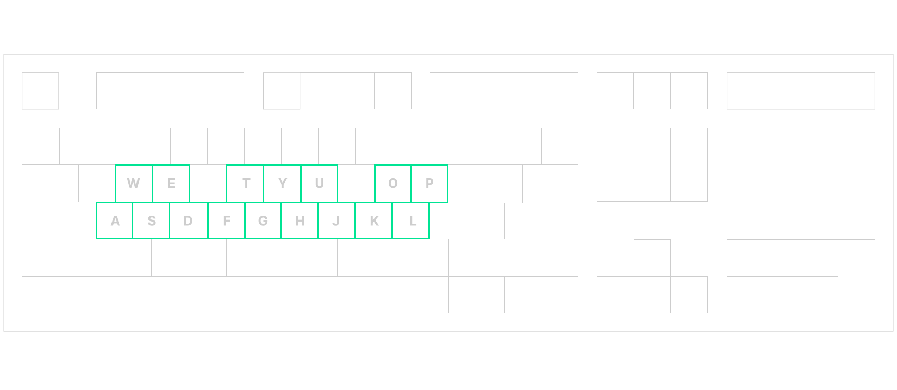
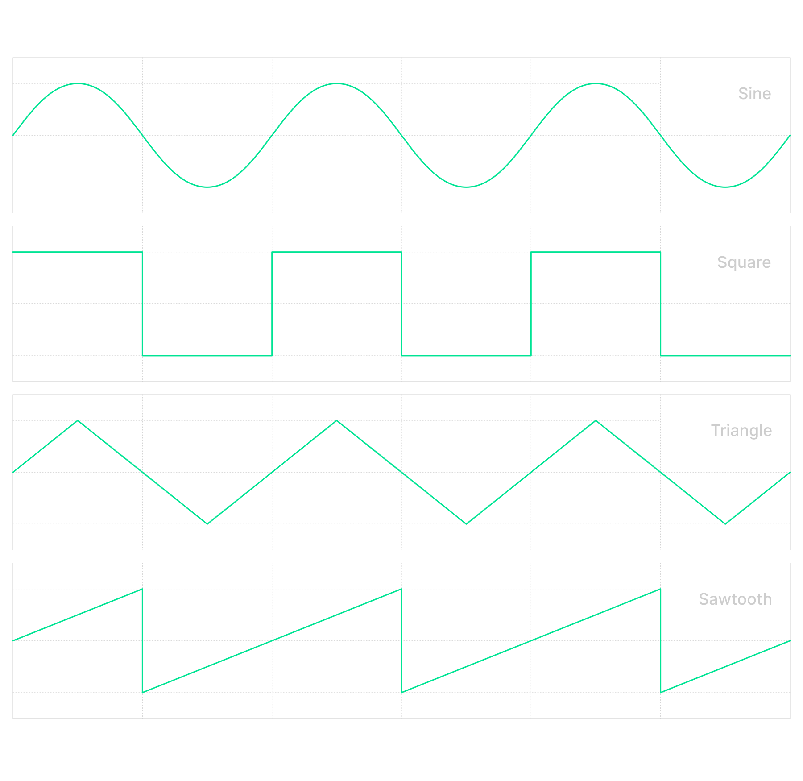

# Synthesizer
The **Synthesizer** is an interactive web application that functions as a musical synthesizer. It is designed to be used on mobile devices, offering an intuitive and sound-focused experience. The application includes a virtual keyboard, sound configuration controls, and a responsive design for optimal viewing on small screens.

## Key Features
### Interactive Virtual Keyboard
- **17 keys** (10 white and 7 black) representing the musical notes of a tenth or octave + a major third.
- The **white keys** correspond to natural notes (**C, D, E, F, G, A, B, C, D, E**).
- The **black keys** represent sharp notes (**C#, D#, F#, G#, A#, C#, D#**).

### Computer Keyboard Control
- Each key on the keyboard is mapped to a specific note.
- White keys: **A (C4), S (D4), D (E4), F (F4), G (G4), H (A4), J (B4), K (C5), L (D5)**.
- Black keys: **W (C#4), E (D#4), T (F#4), Y (G#4), U (A#4), O (C#5), P (D#5)**.

### Sound Controls
- **Volume control:** Regulates the overall volume of the synthesizer.
- **ADSR controls:** Allows you to adjust the sound envelope parameters (**Attack, Decay, Sustain, and Release**).
- **Waveform selector:** Allows you to choose between waveforms such as sine, square, triangle, and sawtooth.
- **Octave selector:** Adjusts the octave of the generated sound (options from octave 4 to 6).
- **Polyphony selector:** Controls the number of simultaneous voices (from 1 to 4 voices).

### Real-time Sound Functionality
- Uses the **Web Audio API** to generate sounds in real time.
- The **ADSR controls** allow customization of sound generation and fading.

## Usage Instructions
1. Open the application in a compatible web browser (**Chrome, Firefox, or Edge**).
2. Tap the virtual keyboard (on touch devices) or click the keys (on computers) to generate sounds.
3. Use the selectors and sliders to customize the sound by modifying the waveform, octave, polyphony, and ADSR parameters.
4. Adjust the overall volume according to your preferences.
5. Explore different combinations to create unique sounds and take advantage of polyphony to play chords or complex melodies.
6. In addition to using the mouse, you can play notes with your computer's keyboard!

## Technologies Used
- **HTML5:** For the structure of the application.
- **CSS3:** For responsive design and visual styles.
- **JavaScript:** For the application logic and DOM manipulation.
- **Web Audio API:** For real-time sound generation and manipulation.

## System Requirements
- **Web browser** compatible with the Web Audio API (**Chrome, Firefox, Edge, Safari**).
- **Mobile device** with a touch screen (recommended) or a computer with a mouse.
- **No internet connection required**, as the application works entirely on the client side.