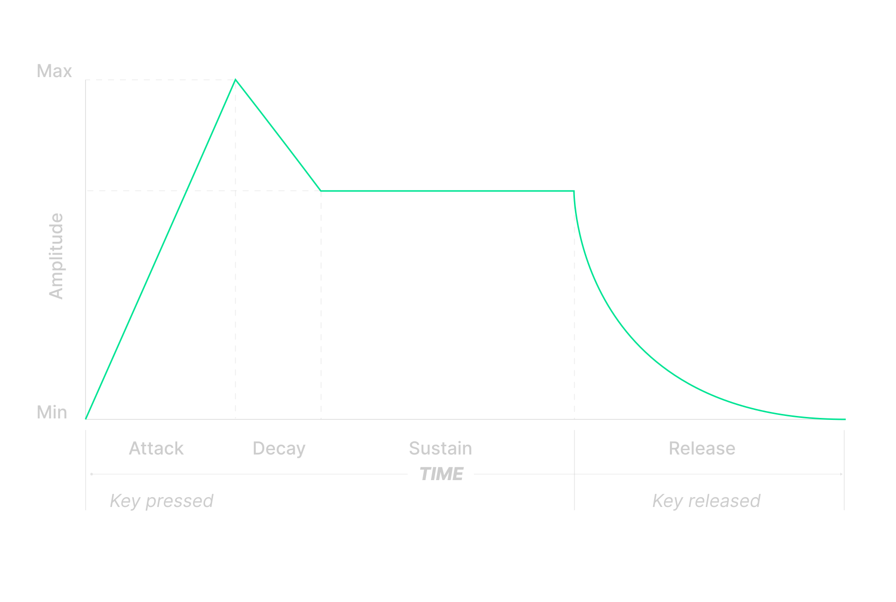

# Synthesizer
The **Synthesizer** is an innovative and interactive web application that brings the power of a musical synthesizer to your fingertips. Designed with a focus on accessibility and usability, it offers a seamless and immersive sound creation experience, perfect for both casual users and music enthusiasts. While optimized for mobile devices, it also serves as a versatile plugin for DAWs (Digital Audio Workstations), making it a valuable tool for music production in any environment. Whether you're crafting melodies on the go or integrating it into your DAW workflow, the Synthesizer is designed to inspire creativity and elevate your musical projects.

## Key Features
### Interactive Virtual Keyboard
- **17 keys** (10 white and 7 black) representing the musical notes of a tenth or octave + a major third.
- The **white keys** correspond to natural notes (**C, D, E, F, G, A, B, C, D, E**).
- The **black keys** represent sharp notes (**C#, D#, F#, G#, A#, C#, D#**).

### Computer Keyboard Control
- Each key on the keyboard is mapped to a specific note.
- White keys: **A (C4), S (D4), D (E4), F (F4), G (G4), H (A4), J (B4), K (C5), L (D5)**.
- Black keys: **W (C#4), E (D#4), T (F#4), Y (G#4), U (A#4), O (C#5), P (D#5)**.

### Sound Controls
- **Volume control:** Regulates the overall volume of the synthesizer.
- **ADSR controls:** Allows you to adjust the sound envelope parameters (**Attack, Decay, Sustain, and Release**).
- **Octave selector:** Adjusts the octave of the generated sound (options from octave 1 to 8).
- **Oscillator selector:** Controls the number of simultaneous harmonics (options from 1 to 8 voices).
- **Waveform selector:** Allows you to choose between waveforms such as sine, square, triangle, and sawtooth.

### Real-time Sound Functionality
- The **Oscillators** functionality enables the simulation of multiple simultaneous harmonics.
- The **ADSR controls** allow customization of sound generation and fading.

### Popular Note Progressions
Feel free to explore the **audio** folder to listen to a variety of **sample tracks** and **sound demos**. These examples showcase the capabilities of the Synthesizer, offering inspiration and a glimpse into the creative possibilities it unlocks.

## Usage Instructions
1. Open the application in a compatible web browser (**Chrome, Firefox, or Edge**).
2. Tap the virtual keyboard (on touch devices) or click the keys (on computers) to generate sounds.
3. Use the selectors and sliders to customize the sound by modifying the waveform, octave, oscillators, and ADSR parameters.
4. Adjust the overall volume according to your preferences.
5. Explore different combinations to create unique sounds and take advantage of oscillators to generate complex melodies.
6. In addition to using the mouse, you can play notes with your computer's keyboard!
7. Capture your performance by starting the recording, and simply stop when you’re done. Your audio file will be downloaded automatically.

## Technologies Used
- **HTML5:** For the structure of the application.
- **CSS3:** For responsive design and visual styles.
- **JavaScript:** For the application logic and DOM manipulation.
- **Web Audio API:** For real-time sound generation and manipulation.
- **Media Recorder API:** For recording and exporting audio.

## System Requirements
- **Web browser** compatible with the Web Audio API (**Chrome, Firefox, Edge, Safari**).
- **Mobile device** with a touch screen (recommended) or a computer with a mouse.
- **No internet connection required**, as the application works entirely on the client side.